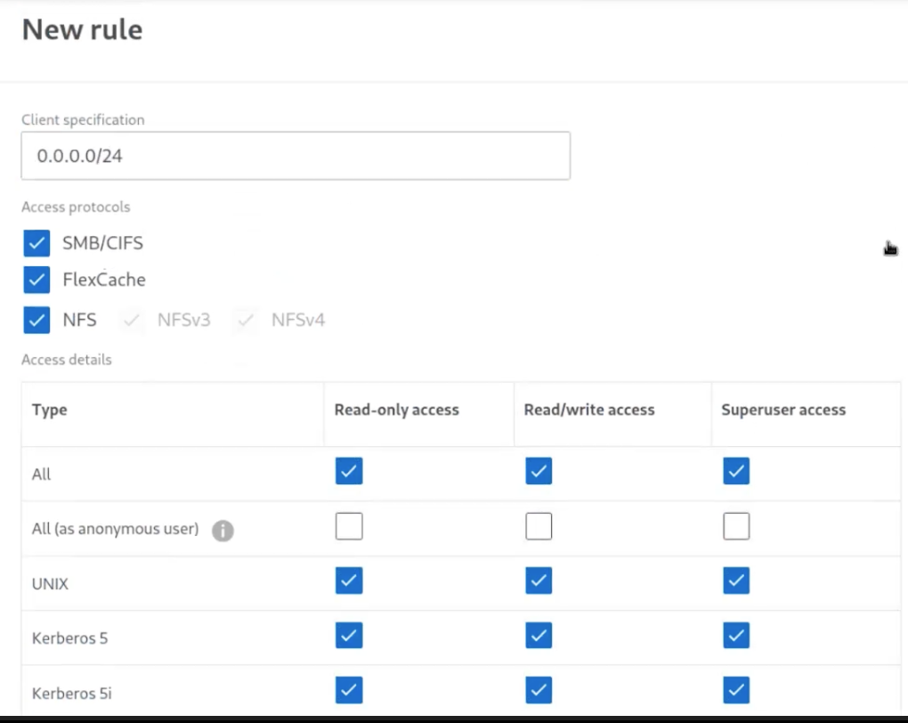
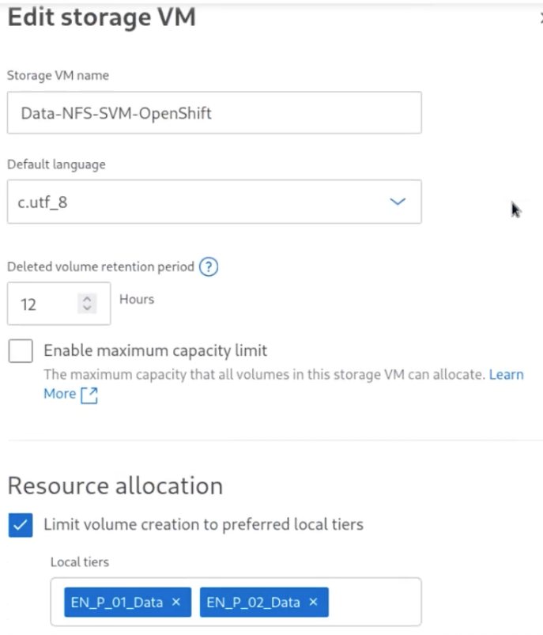

# 🗂️ NetApp Trident Configuration for OpenShift

**Complete Setup Guide for NFS and NVMe/TCP Storage with NetApp Trident**

This guide provides step-by-step instructions for configuring NetApp Trident with OpenShift in disconnected environments, supporting both NFS and NVMe/TCP protocols.

---

## 📋 Requirements and Assumptions

### **📖 Essential References**
- [NetApp Trident Documentation for OpenShift](https://docs.netapp.com/us-en/trident/)

### **🔑 Key Assumptions**
- ✅ NetApp Storage Array is set up and configured
- ✅ Disconnected OpenShift environment
- ✅ Trident operator added to `imageset-config.yaml`
- ✅ Administrative access to NetApp storage system
- ✅ Network connectivity between OpenShift nodes and storage

> 📝 **Important:** Ensure the Trident operator is included in your `imageset-config.yaml` for disconnected installations.

---

## 🗂️ Step 1: NetApp SVM Setup

### **📊 Storage VM Configuration**


#### **➕ Create New SVM**

**Basic Configuration:**
- **SVM Name:** `svm0`
- **IPspace:** `Data-Network-For-OpenShift`
- **Access Protocol:** NFS/CIFS


**Network Setup:**
1. **Click → Add +**
   
   

2. **Configure Network Interfaces:**
   - Set up IP interfaces: `en-p-01` and `en-p-02`
   
   

3. **Edit Broadcast Domain and Port:**
   - Ensure you select the correct HomePort for the VLAN

4. **Set Administrator Account:**
   
   

5. **Add Network Interface for SVM Management:**
   
   

6. **Save the SVM Configuration**

### **🌐 Configure NFS Domain**

**Steps to set up NFS v4 ID domain:**

1. **Navigate to SVM Settings:**
   - Click on the newly created SVM
   - Click **Settings**

2. **Configure NFS Protocol:**
   - Go to **Protocols → NFS → Edit NFS**
   - Add **V4 ID Domain** configuration
   
   

### **💾 Configure SVM Aggregates**

**Assign storage aggregates to SVM:**
- Navigate to **SVM → Select ellipse (⋯) → Edit**
- Configure resource allocation



### **👤 Verify Administrator Account**

**Ensure vsadmin account is active:**
- Navigate to **SVM → Settings → Users**
- Confirm the user is **unlocked** and active

### **⚡ Enable NVMe Protocol**

**Configure NVMe support:**
- Navigate to **SVM → Settings → Protocols**
- **Enable NVMe** protocol

### **🔍 Validate Network Interfaces**

**Verify network configuration:**
- Navigate to **Network → Overview**
- Validate your **SVM LIFs** are properly configured and operational

## 🚀 Step 2: Trident Operator Deployment

### **🌐 Access OpenShift Console**

```bash
# Get your cluster console URL
oc whoami --show-console
```

**Navigate to:** `https://console-openshift-console.apps.{CLUSTER_URL}`

### **📦 Install NetApp Trident Operator**

**Via OpenShift Console:**

1. **Navigate to Operators:**
   - Go to **Operators → OperatorHub**
   - Search and select **"NetApp Trident"**
   
   

2. **Install Configuration:**
   - Click **Install**
   - **Installation Namespace:** Create new project → `trident`
   - Accept default settings and click **Install**

3. **Post-Installation:**
   - Click **View Operator** to verify installation

## 🔧 Step 3: Configure NFSv4 Domain

### **📁 Navigate to Configuration Directory**

```bash
cd cluster/example/netapp
```

### **⚙️ Configure NFSv4 ID Mapping**

**Modify the idmapd configuration:**

```bash
# Decode the current configuration
echo "$STRING$" | base64 -d > idmapd.txt

# Edit the domain configuration
vi idmapd.txt
# Set your domain (e.g., your.domain.com)

# Encode the modified configuration
cat idmapd.txt | base64
```

**Update Machine Configuration:**

```bash
# Edit the machine config file
vi 99-master-idmapd.yaml
# Replace the base64 string with your encoded domain configuration

# Apply the machine configuration
oc apply -f 99-master-idmapd.yaml
```

**Monitor Node Updates:**

```bash
# Watch for node reboots (this will take several minutes)
watch oc get nodes
```

> ⚠️ **Important:** The machine configuration will trigger node reboots. Wait for all nodes to return to Ready status before proceeding.

## 🗂️ Step 4: Deploy NFS Storage Configuration

### **📋 Apply NFS Objects**

```bash
# Switch to trident project
oc project trident

# Deploy NFS configuration objects
oc apply -f objects-nfs.yaml
```

**Created Objects:**
- ✅ **TridentOrchestrator** - Main Trident orchestrator
- ✅ **Secret** - Storage backend credentials
- ✅ **TridentBackendConfig** - Backend storage configuration
- ✅ **StorageClass** - OpenShift storage class
- ✅ **VolumeSnapshotClass** - Snapshot configuration
- ✅ **StorageProfile** - Storage profile settings

### **🔍 Verify Deployment**

```bash
# Check TridentBackendConfig status
oc get tbc trident
```


### **🧪 Test Storage Configuration**

```bash
# Create a test PVC to validate the NetApp Trident storage class
oc apply -f - <<EOF
apiVersion: v1
kind: PersistentVolumeClaim
metadata:
  name: test-netapp-pvc
  namespace: trident
spec:
  accessModes:
    - ReadWriteOnce
  resources:
    requests:
      storage: 1Gi
  storageClassName: trident-nfs
EOF

# Verify PVC status
oc get pvc test-netapp-pvc
```

## ⚡ Step 5: Configure NVMe/TCP Storage

### **🔧 Fix NVMe Host NQN**

> ⚠️ **Known Issue:** Due to a bug, we need to override the hostnqn on each OpenShift node.

```bash
# Apply NVMe host NQN fix
oc apply -f 99-master-ensure-proper-nqn.yaml

# Monitor node updates (wait for machine config to apply)
watch oc get nodes
```

### **📋 Deploy NVMe Storage Objects**

```bash
# Apply NVMe configuration objects
oc apply -f objects-nvme.yaml
```

**Created NVMe Objects:**
- ✅ **TridentBackendConfig** - NVMe backend configuration
- ✅ **StorageClass** - NVMe storage class
- ✅ **Additional NVMe-specific configurations**

---

## ✅ Verification and Testing

### **🔍 Verify All Components**

```bash
# Check Trident pods
oc get pods -n trident

# Verify backend configurations
oc get tbc -n trident

# Check available storage classes
oc get storageclass | grep trident

# Test both NFS and NVMe storage
oc get pvc -A | grep trident
```

### **📊 Monitoring and Troubleshooting**

```bash
# Check Trident operator logs
oc logs -n trident deployment/trident-operator

# Monitor Trident orchestrator
oc describe tbc trident -n trident

# Verify node configurations
oc get mc | grep -E '(idmapd|nqn)'
```

---

> 📝 **Next Steps:** After successful deployment, you can create PVCs using either `trident-nfs` or `trident-nvme` storage classes depending on your application requirements.

**📖 References:**
- [NetApp Trident Documentation](https://docs.netapp.com/us-en/trident/)
- [OpenShift Storage Documentation](https://docs.openshift.com/container-platform/latest/storage/)